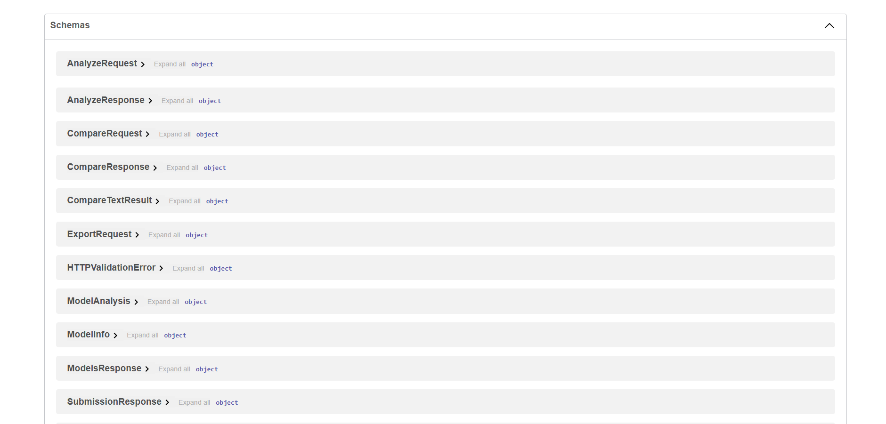
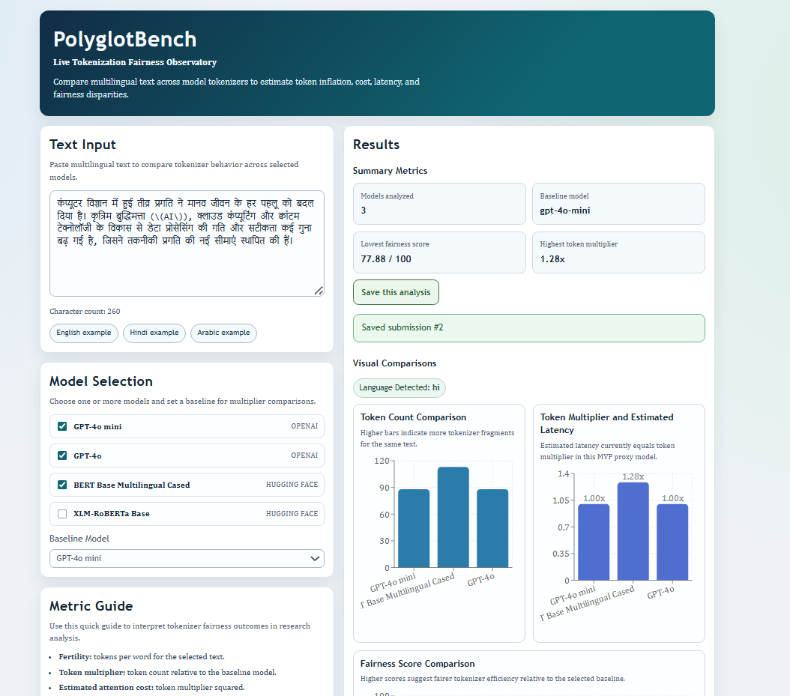
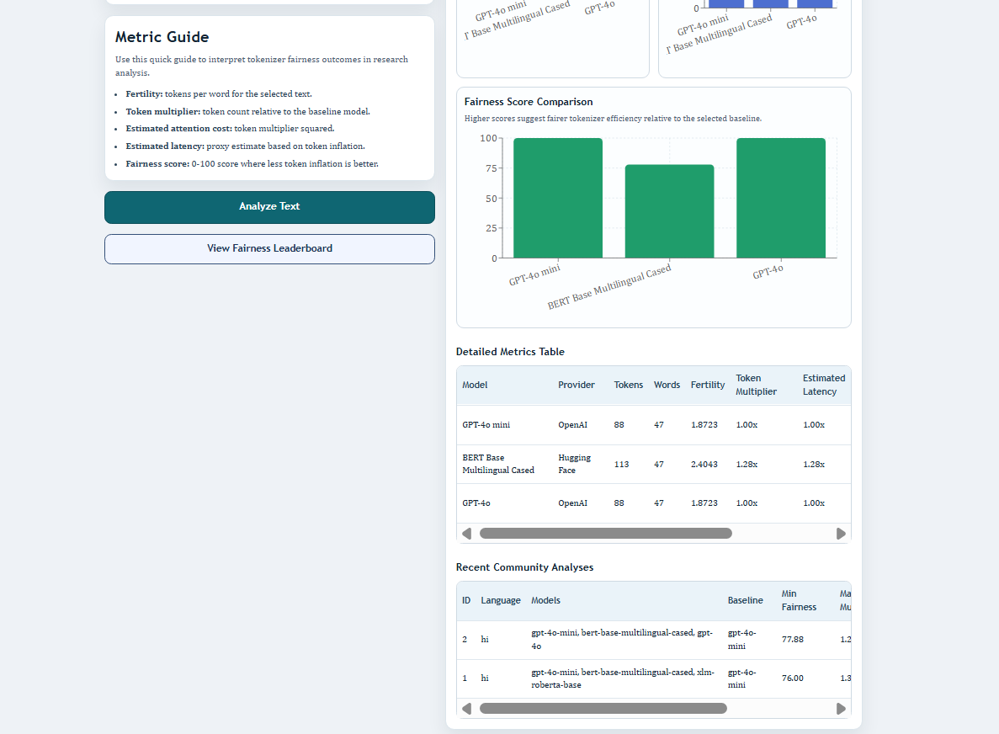
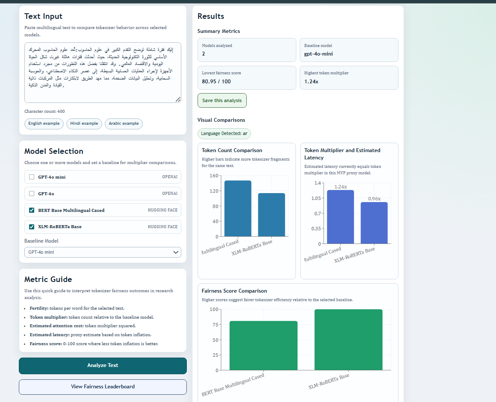
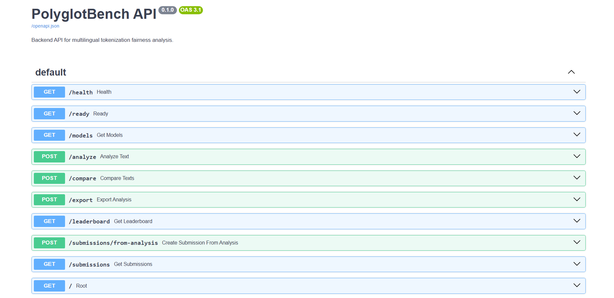

# PolyglotBench

**A live tokenization fairness observatory for multilingual LLMs.**


## Live Demo

Public links are provided below for both the interactive observatory and the backend API documentation.

- [Launch PolyglotBench](https://polyglot-bench.vercel.app)
- [Open FastAPI Docs](https://polyglotbench-api.onrender.com/docs)

## Research Motivation
Large language models are often expected to work equally well across different languages and writing systems. However, the way text is tokenized can vary significantly from one language to another.

Some languages require more tokens to represent the same information. This can increase cost, latency, and overall efficiency differences when using modern language models. These effects are often hidden from users and developers.

PolyglotBench was created to make these differences visible through an interactive observatory that allows users to compare tokenizer behavior across languages and models.

## Research Origin
PolyglotBench was built as a practical extension of the research paper *The Script Tax: Measuring Tokenization-Driven Efficiency and Latency Disparities in Multilingual Language Models*.

The paper studies how tokenization can create measurable efficiency and latency differences across writing systems. It shows that some scripts can experience higher token fragmentation, which can increase computational cost and reduce accessibility when using multilingual language models.

This project turns that research direction into a deployed interactive tool where researchers, students, and developers can test text, compare model tokenizers, and observe tokenization fairness metrics in practice.

### Research Links
- [arXiv Paper](https://arxiv.org/abs/2602.11174)
- [Google Scholar Citation](https://scholar.google.com/citations?view_op=view_citation&hl=en&user=sRBI_S4AAAAJ&citation_for_view=sRBI_S4AAAAJ:u-x6o8ySG0sC)

## Key Features
- Real-time tokenizer comparison
- Fertility calculation
- Token multiplier
- Estimated latency multiplier
- Estimated attention-cost multiplier
- Fairness score
- Multilingual language detection
- Fairness leaderboard
- Saved community analyses
- CSV/JSON export
- Dockerized backend/frontend
- SQLite default and PostgreSQL-ready config

## Interactive Dashboard


PolyglotBench provides an interactive observatory for exploring tokenization fairness across multilingual language models.

## Hindi Analysis Example


This Hindi run highlights how token inflation can increase token multipliers and attention-cost proxies, which lowers fairness scores relative to the selected baseline model.

## Arabic Analysis Example


This Arabic analysis view shows side-by-side fairness comparisons across tokenizer choices, making script-level efficiency differences easy to inspect.

## Community Leaderboard and Saved Analyses


Leaderboard rankings summarize model fairness across benchmark samples, while saved community analyses capture recent runs for shared tracking and comparison.

## FastAPI Backend Documentation


The backend docs expose REST endpoints for single-text analysis, multi-text comparison, export workflows, leaderboard retrieval, and saved-submission access.

## Architecture Overview
```text
User Text
   ↓
React Dashboard
   ↓
FastAPI Backend
   ↓
Tokenizer + Metrics Services
   ↓
SQLite/PostgreSQL
   ↓
Charts, Exports, Leaderboard
```

## Tech Stack
### Backend
- FastAPI
- Pydantic
- SQLAlchemy
- SQLite/PostgreSQL
- tiktoken
- Hugging Face Transformers

### Frontend
- React
- TypeScript
- Vite
- Recharts

### DevOps
- Docker
- Docker Compose

## Metrics
- `token_count`: number of tokenizer-produced tokens for a given model.
- `fertility`: tokens per word (`token_count / word_count`).
- `token_multiplier`: token count relative to baseline model.
- `estimated_attention_cost_multiplier`: squared token multiplier (`token_multiplier^2`).
- `estimated_latency_multiplier`: current proxy equal to token multiplier.
- `fairness_score`: normalized 0-100 score where lower token inflation yields higher fairness.

## Quickstart
### Backend
```powershell
cd backend
python -m venv .venv
.venv\Scripts\Activate.ps1
pip install -r requirements.txt
uvicorn app.main:app --reload
```

### Frontend
```powershell
cd frontend
npm install
npm run dev
```

## Docker Quickstart
```powershell
docker compose up --build
```

## API Endpoints
- `GET /`
- `GET /health`
- `GET /ready`
- `GET /models`
- `POST /analyze`
- `POST /compare`
- `POST /export`
- `GET /leaderboard`
- `POST /submissions/from-analysis`
- `GET /submissions`

## Example API Request
```bash
curl -X POST "http://localhost:8000/analyze" \
  -H "Content-Type: application/json" \
  -d '{
    "text": "Artificial intelligence is changing how people build software.",
    "model_ids": ["gpt-4o-mini", "gpt-4o", "xlm-roberta-base"],
    "baseline_model_id": "gpt-4o-mini"
  }'
```

## Repository Structure
```text
polyglotbench/
├── backend/
│   ├── app/
│   │   ├── api/
│   │   ├── core/
│   │   ├── db/
│   │   ├── schemas/
│   │   ├── services/
│   │   └── tests/
│   ├── Dockerfile
│   ├── requirements.txt
│   └── README.md
├── frontend/
│   ├── src/
│   ├── Dockerfile
│   └── nginx.conf
├── docs/
│   ├── ARCHITECTURE.md
│   ├── API_EXAMPLES.md
│   ├── DATABASE.md
│   ├── DEMO_SCRIPT.md
│   └── DEPLOYMENT.md
├── research/
├── docker-compose.yml
└── README.md
```

## Development Status
MVP complete. Deployment and production hardening in progress.

## Roadmap
- public deployment
- PDF reports
- Alembic migrations
- richer tokenizer registry
- larger curated multilingual benchmark
- admin-reviewed public leaderboard
- real latency benchmarking

## Research Attribution
This project is inspired by the Script Tax research direction on tokenization-driven disparities in multilingual language models.

## Additional Docs
- [docs/ARCHITECTURE.md](docs/ARCHITECTURE.md)
- [docs/API_EXAMPLES.md](docs/API_EXAMPLES.md)
- [docs/DEMO_SCRIPT.md](docs/DEMO_SCRIPT.md)
- [docs/DEPLOYMENT.md](docs/DEPLOYMENT.md)
- [docs/DATABASE.md](docs/DATABASE.md)
